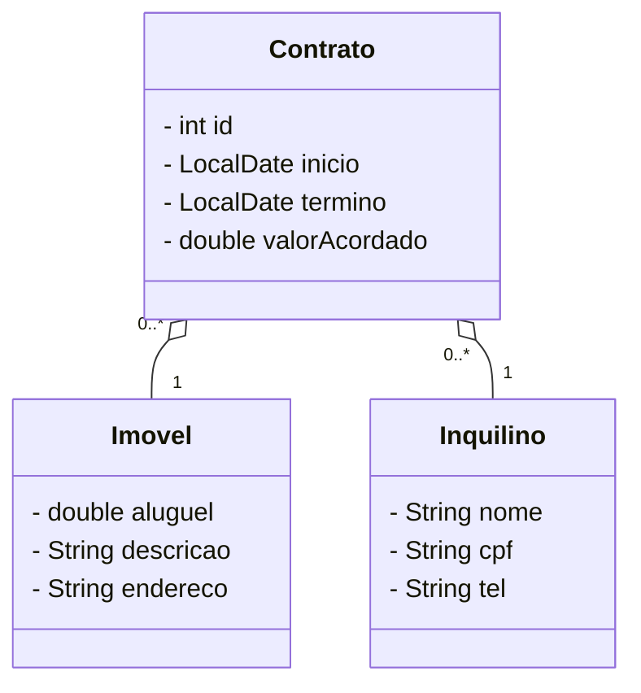

# Atividade 2

# Atividade 3

## 1. Livro

### Atributos
- Título
- Autor
- ISBN
- Número de páginas

### Métodos
- Livro(título, autor, ISBN, páginas)
- getTitulo()
- setTitulo(título)
- getAutor()
- setAutor(autor)
- getISBN()
- getNumeroPaginas()

## 2. Círculo

### Atributos
- Raio
- Centro X
- Centro Y

### Métodos
- Circulo(raio, x, y)
- getRaio()
- setRaio(raio)
- getCentroX()
- setCentroX(x)
- getCentroY()
- setCentroY(y)
- calcularArea()
- calcularCircunferencia()

## 3. Filme

### Atributos
- Título
- Diretor
- Gênero
- Duração

### Métodos
- Filme(título, diretor, gênero, duração)
- getTitulo()
- setTitulo(título)
- getDiretor()
- setDiretor(diretor)
- getGenero()
- getDuracao()

## 4. Pessoa

### Atributos
- Nome
- CPF
- Idade
- Endereço
- Telefone

### Métodos
- Pessoa(nome, CPF, idade, endereço, telefone)
- getNome()
- setNome(nome)
- getCPF()
- setCPF(CPF)
- getIdade()
- setIdade(idade)
- getEndereco()
- setEndereco(endereço)
- getTelefone()
- setTelefone(telefone)
