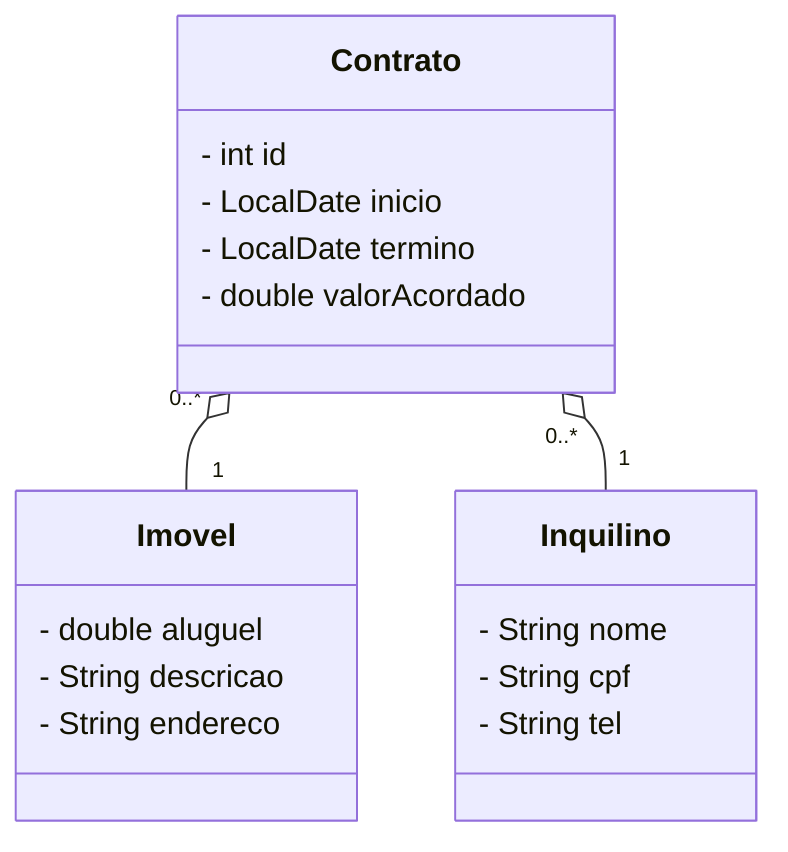

```mermaid
classDiagram
    
    class Imovel{
        - double aluguel
        - String descricao
        - String endereco
    }
 
    class Inquilino{
        - String nome
        - String cpf
        - String tel
    }
    
    class Contrato{
        - int id
        - LocalDate inicio
        - LocalDate termino
        - double valorAcordado
    }
    
    Contrato "0..*" o-- "1" Imovel
    Contrato "0..*" o-- "1" Inquilino

```